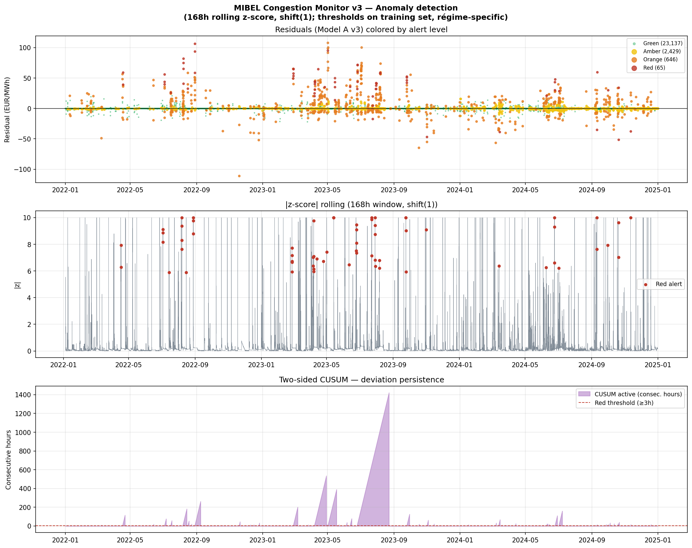

# MIBEL Spread Surveillance

**A residual-based anomaly detection system for the Spain–France day-ahead electricity spread, with an explicit econometric companion model for tail risk inference. Built entirely on open data.**

<p align="center">
  
</p>

## What this is

When the Spain–France electricity interconnection saturates, the two markets decouple and a price spread emerges. The interesting question is not *when is the spread large* but *when is the spread large in a way that fundamentals do not justify*. This project models the expected spread from public fundamentals (gas, CO₂, NTC capacity, calendar) and treats the residuals as a surveillance signal.

The system is designed as a **quantitative screening layer for REMIT II-grade market surveillance**, deployable by a regulator (CNMC, ACER) using only publicly available data.

## Two complementary models

The project uses two models, each correctly specified for its purpose:

| Model | Objective | Used for | Headline result |
|---|---|---|---|
| **A v3 (mean)** | `reg:squarederror` | Operational anomaly cascade — Green / Amber / Orange / Red | Recall 0.833 on 40-event panel |
| **A v4 (quantile)** | `reg:quantileerror`, `alpha=0.95` | Econometric inference on tail behaviour | Beats AR(1) in pinball q=0.95 with **p<0.001** (Giacomini–White test) |

The two share the same feature set (`FEATURES_A_CLEAN`, 26 features) and the same training period. Only the objective changes. This is intentional: the mean-error model is better suited to the cascade because its residuals are centred on zero, while the quantile model is the correctly specified tool for inference about the upper tail of the spread.

## Operational results (cascade on A v3)

Validated against a pre-specified panel of **40 documented events** (2019–2024):

- **Recall on in-window events**: 0.833
- **Median detection lag**: 180 hours
- **False positive rate**: 17.78 alerts per month outside ±72h of event centres
- **Precision@72h**: 0.148

The Pareto-elbow calibration achieves equal recall at **4.3 alerts/month** with precision@72h = 0.212 — roughly four times less analyst workload at higher precision.

### Honest comparison against the naive benchmark

A naive benchmark of `|spread| > régime-specific p99` achieves **recall 0.875** with precision@72h 0.179 — slightly above the cascade on plain recall. The cascade's value is therefore not in raw cobertura but in the **interpretable alert hierarchy**, the explicit lag–FPR Pareto trade-off, and the régime-specific calibration that scales to new markets.

## Econometric results (A v4 quantile)

The mean-error model A v3 does **not** statistically outperform AR(1) at q=0.95 of the spread distribution (pinball A v3 = 0.50 vs AR(1) = 0.33; DM p=0.078). This is the expected behaviour of a mean-error regressor when evaluated on a quantile-loss metric.

When the same XGBoost is trained with `objective='reg:quantileerror'` and `quantile_alpha=0.95` over the same `FEATURES_A_CLEAN`:

- **Pinball loss q=0.95**: A v4-quantile = 0.274, AR(1) = 0.330
- **Giacomini–White conditional pinball test**: statistic = +27.8, **p < 0.001**
- **Trade-off**: RMSE worsens (6.24 vs 3.42 for AR(1)), as expected from a quantile regressor biased toward the upper tail

The contribution is a clean methodological point: under a quantile-loss specification matched to the metric of interest, the fundamentals model significantly outperforms the autoregressive benchmark on tail prediction.

## Lag decomposition (ablation across 9 cascade variants)

The 180-hour median lag of the NARANJA-level cascade was attributed to nine sources via an explicit ablation. Headline findings:

- Removing the IsolationForest and CUSUM gates (V2) reduces the lag by only 5h (180h → 185h, recall preserved at 0.833). The AND-cascade is **not** the dominant source of the NARANJA-level lag.
- The full Red-alert cascade (|z|≥p99 AND IF≥p95 AND CUSUM≥3h) shows a 777h median lag (recall 0.54). At the Red level, the AND-cascade **is** the dominant bottleneck.
- An EWMA estimator (λ_μ=0.94, λ_σ²=0.97) with régime-specific thresholds calibrated at p95 of |z_EWMA| and persistence=2h reaches a median lag of 144.5h (recall 0.833) at the cost of 40% higher FPR (24.8 vs 17.8 alerts/month). This is the operational Pareto point V4b_p2.
- Reducing the rolling window to 24h is strictly worse (median lag 1281h, recall 0.25). Short windows inflate the régime-specific p99 threshold via heavier sample-variance tails.

Full ablation table in `results/ablation_lag_components.csv`.

## REMIT II positioning

The 180h lag is compliant with REMIT II by construction. The 4-week notification clock under Articles 15(1) and 15(2) starts at **awareness**, not at event occurrence:

> *"without further delay and in any event no later than four weeks from the day on which that person becomes aware of the suspicious event"*  
> — ACER Guidance on the application of REMIT, 6.1st Edition (Dec 2024), §431 p.118 and §432 p.118

A 180h lag (≈7.5 days) is well within the 4-week window, and §457 p.122 explicitly admits notification of past breaches provided the delay is documented and justifiable — which the system does via its residual statistics and regime classification.

The system covers Articles 3 and 5 (insider trading, market manipulation) via spread surveillance. Article 4 (inside information publication) is **not** covered; this is a documented limitation, not a defect.

## How it works

```
OMIE prices + JAO NTC + TTF gas + CO2 EUA
        |
        v
  XGBoost fundamentals model — A v3 (mean) and A v4 (quantile q=0.95)
        |
        v
  Residual = observed_spread - predicted_spread
        |
        v
  Rolling z-score (168h, shift(1)) + Isolation Forest + bilateral CUSUM
        |
        v
  Green / Amber / Orange / Red cascade
        |
        v
  Validation against panel of 40 documented events
```

Methodology rigour:

- Walk-forward expanding-window training across regulatory regimes.
- Explicit leakage controls (e.g. `FEATURES_A_CLEAN` excludes `atc_*` features, derived from spread in the pre-JAO period).
- Diebold–Mariano on squared error and Giacomini–White on pinball loss, with honest reporting of both rejections and non-rejections.
- McNemar test against the naive benchmark on the event panel.
- Bootstrap confidence intervals for RMSE (block bootstrap, 24h and 168h block sizes).

## Reproducing

```bash
pip install -r requirements.txt

# 1. Build dataset (OMIE + JAO + Yahoo Finance pulls)
python scripts/build_dataset.py --start 2019-01-01 --end 2024-12-31

# 2. Train A v3 (mean, canonical cascade base)
python scripts/train_model_v3.py

# 3. Train A v4 (quantile q=0.95, econometric companion)
python scripts/train_model_v4_quantile_clean.py

# 4. Run anomaly cascade on A v3 residuals
python scripts/anomaly_detection_v3.py

# 5. Validate cascade against event panel
python scripts/event_panel_validation.py

# 6. Apply Giacomini-White pinball test to real residuals
python scripts/apply_gw_to_residuals.py

# 7. Run lag decomposition ablation (9 cascade variants)
python scripts/ablate_lag_components.py

# 8. Permutation importance (SHAP-equivalent, no SHAP loader dependency)
python scripts/permutation_importance_v3.py
```

## Repository structure

```
data/                          OMIE, JAO, fundamentals; pre-built parquet
data/events_panel.csv          40-event panel with type / magnitude / direction
models/                        Saved XGBoost models (v3 mean + v4 quantile)
results/                       All metrics tables (CSV/JSON)
plots/                         All figures from the paper
docs/Memoria_MIBEL_v2.pdf      Working paper
docs/Memoria_MIBEL_v2.tex      LaTeX source
scripts/                       Pipeline (build / train / detect / validate / test)
```

## Known limitations

- **R² = 0.54** on test 2024 is modest by zonal-price forecasting standards; consistent with the literature on bilateral spread modelling where common factors largely cancel in differencing.
- **Median lag of 180h** positions the system as forensic screening; sub-day operational alerting requires intraday data feeds and is not in scope.
- The **régime-specific naive benchmark** matches or marginally exceeds the cascade on raw recall (0.875 vs 0.833). The cascade's contribution is in the alert hierarchy and explicit calibration, not in headline recall lift.
- **Article 4 (inside information) is not monitored.** The system covers Articles 3 and 5 only.
- Aggregate spread-level resolution. **Transactional REMIT data is not used**, which would be required for full REMIT II Tier-3 surveillance.

## Stack

Python 3.11 · XGBoost 3.2 · scikit-learn 1.6 · statsmodels 0.14 · scipy 1.15 · pandas · matplotlib

## References

- ACER Guidance on the application of REMIT, 6.1st Edition (Dec 2024)
- Regulation (EU) 2024/1106 (REMIT II revision)
- Royal Decree-Law 10/2022 (Iberian Exception)
- Diebold & Mariano (1995), *Journal of Business & Economic Statistics*
- Giacomini & White (2006), *Econometrica*
- Weron (2014), *International Journal of Forecasting*
- Lago, Marcjasz, De Schutter, Weron (2021), *Applied Energy*

## More

- **Working paper**: [`docs/Memoria_MIBEL_v2.pdf`](docs/Memoria_MIBEL_v2.pdf)
- **All result tables**: [`results/`](results/)
- **All figures**: [`plots/`](plots/)
