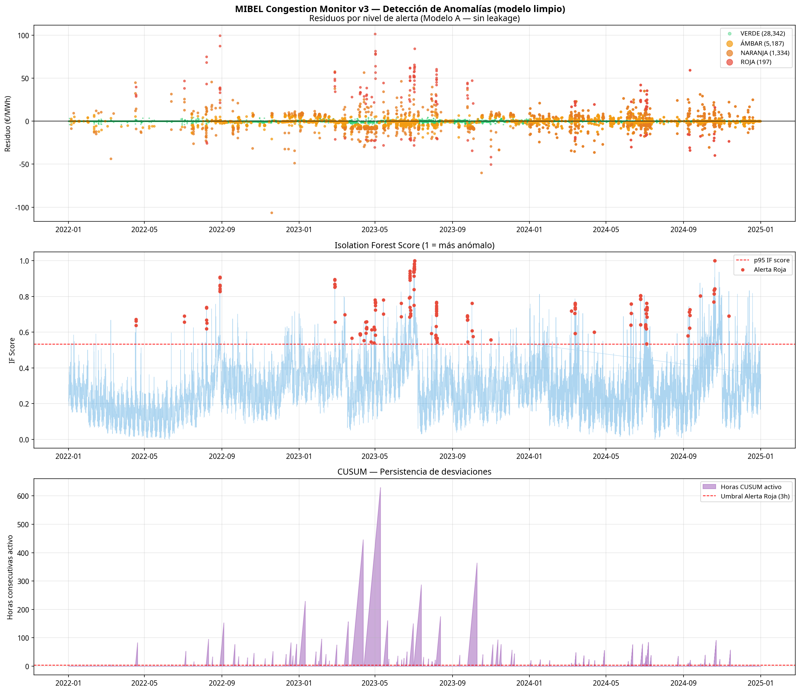

# MIBEL Spread Surveillance

**A residual-based monitoring system for the Spain–France electricity spread — flags anomalies that pure threshold rules miss, using only open data.**

<p align="center">
  
</p>

When the Spain–France electricity interconnection saturates, the two markets decouple and a price spread emerges. The interesting question is not "when is the spread large" but "when is the spread large *in a way that the fundamentals don't explain*". This project answers that question by modelling the expected spread and treating the residuals as a surveillance signal.

## Headline result

Validated against a **pre-specified panel of 40 documented market events** (2019–2024):

- **Recall: 83.3%** on in-window events.
- **Naive benchmark recall** (|spread| > regime p99): 75.0%.
- **+8.3 pp lift**, and the system **never misses an event the naive benchmark catches**.

Built entirely on open data: OMIE (prices), JAO (NTC capacity), Yahoo Finance (gas, CO₂). No subscription required.

## Why this is non-obvious

- The signal is **not** the spread itself — it's the **residual** between observed spread and the fundamentals-based prediction. Most surveillance systems use the raw spread; this one identifies hours where the dynamics depart from what fundamentals would justify.
- **Operational calibration matters.** The default cascade runs at 21 alerts/month with precision@72h = 0.148. The Pareto-elbow configuration delivers **identical recall at 4 alerts/month** with precision@72h = 0.212 — five times less workload, 43% better precision.
- **Honest limitations.** Median detection lag is 7.5 days, positioning the system as forensic screening, not real-time alerting. R² = 0.54 is modest by zonal-price standards but consistent with the literature on bilateral spreads.

## How it works

```
OMIE prices + JAO NTC + TTF gas + CO2 EUA
        ↓
  XGBoost fundamentals model (ex ante features only)
        ↓
  Residual = observed spread − predicted spread
        ↓
  Rolling z-score (168h, shift+1) + Isolation Forest + bilateral CUSUM
        ↓
  Green / Amber / Orange / Red cascade
```

**Methodology rigour:**

- Walk-forward expanding-window evaluation across regulatory regimes.
- Explicit leakage test: contemporaneous intraday features inflate R² from 0.64 to 0.92 (Model A vs Model C ablation).
- Diebold–Mariano benchmarks against AR(1), AR(24), LASSO — honest reporting of non-significance (p ∈ [0.06, 0.12]) on the 2024 test set.
- McNemar test against the naive benchmark on the event panel.

## Stack

Python · XGBoost · SHAP · pandas · DuckDB

## Run it

```bash
pip install -r requirements.txt
python scripts/build_dataset.py --start 2019-01-01 --end 2024-12-31
python scripts/train_model_v2.py
python scripts/anomaly_detection_v2.py
```

The processed dataset is included in `data/` for immediate use.

## More

- **Working paper (PDF)**: [`docs/Memoria_MIBEL_CarloVilches.pdf`](docs/Memoria_MIBEL_CarloVilches.pdf)
- **Result tables**: [`results/`](results/)
- **All figures**: [`plots/`](plots/)
